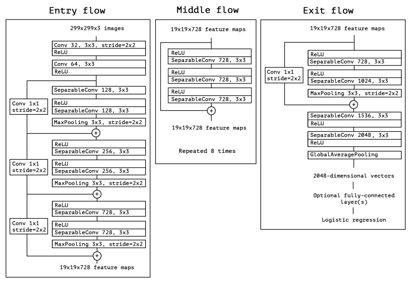

# 🍎 Xception-Replication PyTorch Implementation

This repository contains a replication of **Xception** using PyTorch. The goal is to build a **deep CNN backbone** with **depthwise separable convolutions** for efficient feature extraction in image classification tasks.

- Implemented **Xception** using **Depthwise → Pointwise convolutions** in a stack of Entry, Middle, and Exit flows.  
- Architecture:  
**Conv → SeparableConv → SeparableConv → ... → MiddleBlock(8×SepConv) → ExitFlow → GlobalAvgPool → Flatten → FC**  
**Paper**: [Xception: Deep Learning with Depthwise Separable Convolutions](https://arxiv.org/abs/1610.02357)

---

## 🖼 Overview – Xception Architecture

  

**Figure 5:** Sketch of Xception stages. The model consists of:  
- **Entry Flow:** Conv layers followed by 3 Xception blocks, gradually increasing channel depth and reducing spatial size.  
- **Middle Flow:** 8 repeated modules of 3 SeparableConv layers each with residual connections.  
- **Exit Flow:** One Xception block followed by two SeparableConv layers, finishing with **GlobalAvgPool → Flatten → FC**.  

> **Model overview:**  
> Xception is a deep, fully convolutional network designed for **efficient use of parameters**. It decouples **cross-channel correlations** and **spatial correlations** via depthwise separable convolutions, slightly outperforming Inception V3 on ImageNet while keeping a similar number of parameters.

---

## 🏗 Project Structure

```bash
Xception-Replication/
│
├── src/
│   ├── layers/
│   │   ├── separable_conv.py          # Depthwise + pointwise basic separable conv
│   │   ├── separable_block.py         # SepConv + BN + ReLU (Xception style)
│   │   ├── xception_block.py          # Entry/Exit block (reps, skip, stride)
│   │   ├── middle_block.py            # 3 SepConv + residual (8 repetitions)
│   │   ├── pooling/
│   │   │   └── global_avgpool.py      # AdaptiveAvgPool2d
│   │   └── flatten_layer.py           # Flatten
│   │
│   ├── model/
│   │   └── xception_model.py          # Entry + Middle(8) + Exit flow combination
│   │
│   └── config.py                      # Input size, num_classes, repetitions, etc.
│
├── images/
│   └── xception_architecture.jpg
│
├── requirements.txt
└── README.md
```
---

## 🔗 Feedback

For questions or feedback, contact: [barkin.adiguzel@gmail.com](mailto:barkin.adiguzel@gmail.com)
